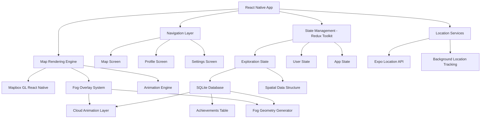

# Design Document

## Overview

Cartographer is a React Native application built with Expo that creates an immersive fog-of-war exploration experience. The app uses Mapbox GL JS for React Native to render high-quality maps with custom fog overlay animations. The core architecture centers around real-time GPS tracking, efficient spatial data management, and smooth animation rendering to create an engaging exploration game that reveals the world as users physically visit locations.

## Architecture

### High-Level Architecture



### Core Components

1. **Map Container**: Main component housing Mapbox map and fog overlay
2. **Fog Overlay System**: Custom layer rendering animated clouds and managing fog state
3. **Location Manager**: Handles GPS tracking, permissions, and location updates
4. **Exploration Engine**: Processes location data and manages fog clearing logic
5. **Data Persistence Layer**: Manages local storage of exploration progress
6. **Animation Controller**: Orchestrates fog dissipation and cloud movement animations

## Components and Interfaces

### MapContainer Component
```typescript
interface MapContainerProps {
  exploredAreas: ExploredArea[];
  currentLocation: Location | null;
  onLocationUpdate: (location: Location) => void;
}

interface MapContainerState {
  mapReady: boolean;
  fogOverlayVisible: boolean;
  animationInProgress: boolean;
}
```

### FogOverlaySystem Component
```typescript
interface FogOverlayProps {
  exploredAreas: ExploredArea[];
  animationSpeed: number;
  cloudDensity: number;
  onFogCleared: (area: GeographicArea) => void;
}

interface CloudLayer {
  id: string;
  geometry: GeoJSON.Polygon;
  opacity: number;
  animationState: 'static' | 'dissipating' | 'cleared';
}
```

### LocationManager Service
```typescript
interface LocationManagerConfig {
  accuracy: LocationAccuracy;
  distanceInterval: number;
  timeInterval: number;
  backgroundMode: boolean;
}

interface LocationUpdate {
  latitude: number;
  longitude: number;
  accuracy: number;
  timestamp: number;
}
```

### ExplorationEngine Service
```typescript
interface ExplorationArea {
  id: string;
  center: [number, number];
  radius: number;
  exploredAt: Date;
  clearingProgress: number; // 0-1 for animation
}

interface ExplorationState {
  totalAreasExplored: number;
  explorationPercentage: number;
  currentStreak: number;
  achievements: Achievement[];
}
```

## Data Models

### Geographic Data Structure
The app uses a hierarchical spatial data structure for efficient fog management:

```typescript
interface SpatialGrid {
  cellSize: number; // degrees (e.g., 0.01 = ~1km)
  cells: Map<string, GridCell>;
}

interface GridCell {
  id: string; // "lat_lng" format
  bounds: BoundingBox;
  explored: boolean;
  exploredAt?: Date;
  fogOpacity: number; // 0-1, for gradual clearing
}

interface BoundingBox {
  north: number;
  south: number;
  east: number;
  west: number;
}
```

### User Progress Data
```typescript
interface UserProfile {
  id: string;
  createdAt: Date;
  totalDistance: number;
  countriesVisited: string[];
  citiesVisited: string[];
  explorationStats: ExplorationStats;
}

interface ExplorationStats {
  totalAreasExplored: number;
  explorationPercentage: number;
  longestStreak: number;
  favoriteRegions: string[];
  monthlyProgress: MonthlyStats[];
}
```

## Error Handling

### Location Services Error Handling
1. **Permission Denied**: Graceful fallback to manual exploration mode with educational prompts
2. **GPS Unavailable**: Offline mode with cached map data and manual area selection
3. **Low Accuracy**: Implement confidence thresholds and user feedback for uncertain locations
4. **Background Restrictions**: Handle iOS/Android background location limitations with user notifications

### Map Rendering Error Handling
1. **Network Connectivity**: Implement offline map tiles caching with Mapbox offline capabilities
2. **Memory Constraints**: Progressive fog detail reduction on lower-end devices
3. **Animation Performance**: Adaptive frame rate and animation complexity based on device capabilities
4. **Mapbox API Limits**: Implement request throttling and error recovery mechanisms

### Data Persistence Error Handling
1. **Database Corruption**: SQLite integrity checks with automatic repair and backup restoration
2. **Storage Full**: Implement data cleanup policies for old exploration data beyond retention period
3. **Migration Failures**: Version-aware SQLite schema migrations with rollback capabilities
4. **Concurrent Access**: Proper SQLite connection management and transaction handling

## Testing Strategy

### Unit Testing
- **Location Services**: Mock GPS coordinates and test exploration area calculations
- **Fog Overlay Logic**: Test fog clearing algorithms with various geographic scenarios
- **Data Persistence**: Test SQLite operations, spatial queries, and data integrity
- **Animation Controllers**: Test fog dissipation timing and visual state transitions

### Integration Testing
- **Mapbox Integration**: Test map loading, tile rendering, and custom layer integration
- **Location + Fog System**: Test end-to-end flow from GPS update to fog clearing
- **Cross-Platform Behavior**: Test iOS vs Android location service differences
- **Background Processing**: Test location tracking when app is backgrounded

### Performance Testing
- **Animation Frame Rate**: Ensure 60fps during fog animations on target devices
- **Memory Usage**: Monitor memory consumption during extended exploration sessions
- **Battery Impact**: Test location tracking efficiency and battery optimization
- **Map Tile Loading**: Test performance with various network conditions

### User Experience Testing
- **Onboarding Flow**: Test permission requests and initial user education
- **Fog Clearing Satisfaction**: Test animation timing and visual feedback
- **Navigation Usability**: Test map controls and interface responsiveness
- **Achievement System**: Test progress tracking and gamification elements

## Technical Implementation Details

### Fog Rendering Approach
The fog overlay uses Mapbox's custom layer API to render animated cloud textures:
1. **Base Fog Layer**: Semi-transparent overlay covering unexplored areas
2. **Cloud Animation**: Procedural cloud movement using shader-based animations
3. **Clearing Animation**: Smooth fog dissipation using opacity transitions and particle effects
4. **Performance Optimization**: Level-of-detail rendering based on zoom level

### Location Tracking Strategy
1. **Foreground Tracking**: High-accuracy GPS updates when app is active
2. **Background Tracking**: Efficient location updates using significant location changes
3. **Geofencing**: Create virtual boundaries around explored areas for re-entry detection
4. **Privacy Protection**: Local-only storage with no server transmission of location data

### Data Storage Architecture
1. **Exploration Data**: SQLite database with spatial indexing for efficient geographic queries
2. **Map Cache**: Mapbox offline manager for map tiles and vector data
3. **User Preferences**: AsyncStorage for lightweight settings and app state
4. **Backup Strategy**: SQLite database export/import functionality for user data portability

### SQLite Schema Design
```sql
-- Explored areas with spatial indexing
CREATE TABLE explored_areas (
  id INTEGER PRIMARY KEY AUTOINCREMENT,
  latitude REAL NOT NULL,
  longitude REAL NOT NULL,
  radius REAL NOT NULL,
  explored_at DATETIME NOT NULL,
  accuracy REAL,
  created_at DATETIME DEFAULT CURRENT_TIMESTAMP
);

-- Spatial index for efficient geographic queries
CREATE INDEX idx_explored_areas_location ON explored_areas(latitude, longitude);

-- User statistics and achievements
CREATE TABLE user_stats (
  id INTEGER PRIMARY KEY,
  total_areas_explored INTEGER DEFAULT 0,
  total_distance REAL DEFAULT 0,
  exploration_percentage REAL DEFAULT 0,
  current_streak INTEGER DEFAULT 0,
  longest_streak INTEGER DEFAULT 0,
  updated_at DATETIME DEFAULT CURRENT_TIMESTAMP
);

-- Achievement tracking
CREATE TABLE achievements (
  id INTEGER PRIMARY KEY AUTOINCREMENT,
  type TEXT NOT NULL,
  name TEXT NOT NULL,
  description TEXT,
  unlocked_at DATETIME,
  progress REAL DEFAULT 0
);
```