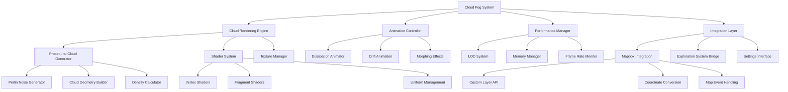

# Design Document

## Overview

The Cloud-Based Fog of War System implements a sophisticated volumetric cloud rendering engine built on top of Mapbox GL React Native. The system uses a multi-layered approach combining procedural cloud generation, GPU-accelerated shaders, and efficient texture management to create realistic cloud effects that obscure unexplored map areas. The architecture leverages WebGL shaders through Mapbox's custom layer API, procedural noise algorithms for cloud generation, and optimized animation systems to deliver smooth 60fps performance on mobile devices.

## Architecture

### High-Level Architecture



### Core Components

1. **CloudRenderingEngine**: Main orchestrator for cloud generation and rendering
2. **ProceduralCloudGenerator**: Creates realistic cloud patterns using noise algorithms
3. **ShaderSystem**: Manages WebGL shaders for volumetric cloud effects
4. **AnimationController**: Handles cloud movement, dissipation, and morphing
5. **PerformanceManager**: Optimizes rendering based on device capabilities
6. **TextureManager**: Efficiently manages cloud textures and atlases

## Components and Interfaces

### CloudRenderingEngine Component
```typescript
interface CloudRenderingEngineProps {
  exploredAreas: ExploredArea[];
  mapBounds: MapBounds;
  zoomLevel: number;
  performanceMode: PerformanceMode;
  onCloudStateChange: (state: CloudState) => void;
}

interface CloudRenderingEngine {
  initialize(): Promise<void>;
  updateClouds(exploredAreas: ExploredArea[]): void;
  animateCloudDissipation(area: GeographicArea): Promise<void>;
  setPerformanceMode(mode: PerformanceMode): void;
  dispose(): void;
}
```

### ProceduralCloudGenerator Service
```typescript
interface CloudGeneratorConfig {
  cloudDensity: number; // 0-1
  noiseScale: number;
  octaves: number;
  persistence: number;
  lacunarity: number;
  windDirection: Vector2;
  windSpeed: number;
}

interface CloudPatch {
  id: string;
  bounds: BoundingBox;
  vertices: Float32Array;
  indices: Uint16Array;
  densityMap: Float32Array;
  textureCoords: Float32Array;
}
```

### ShaderSystem Component
```typescript
interface ShaderUniforms {
  u_time: number;
  u_cloudDensity: number;
  u_windVector: [number, number];
  u_dissipationCenter: [number, number];
  u_dissipationRadius: number;
  u_zoomLevel: number;
  u_viewMatrix: Float32Array;
  u_projectionMatrix: Float32Array;
}

interface CloudShaderProgram {
  program: WebGLProgram;
  uniforms: Record<string, WebGLUniformLocation>;
  attributes: Record<string, number>;
}
```

### AnimationController Service
```typescript
interface AnimationState {
  cloudDrift: {
    offset: Vector2;
    speed: number;
    direction: number;
  };
  dissipation: {
    active: boolean;
    center: [number, number];
    radius: number;
    progress: number; // 0-1
    duration: number;
  };
  morphing: {
    noiseOffset: number;
    morphSpeed: number;
  };
}

interface DissipationAnimation {
  startTime: number;
  duration: number;
  center: [number, number];
  maxRadius: number;
  easing: EasingFunction;
}
```

## Data Models

### Cloud Geometry Structure
```typescript
interface CloudGrid {
  cellSize: number; // meters
  cells: Map<string, CloudCell>;
  textureAtlas: CloudTextureAtlas;
}

interface CloudCell {
  id: string;
  worldPosition: [number, number];
  vertices: CloudVertex[];
  density: number;
  explored: boolean;
  dissipationState: DissipationState;
}

interface CloudVertex {
  position: [number, number, number]; // x, y, z (elevation)
  texCoord: [number, number];
  density: number;
  normal: [number, number, number];
}

interface CloudTextureAtlas {
  texture: WebGLTexture;
  width: number;
  height: number;
  tileSize: number;
  cloudPatterns: CloudPattern[];
}
```

### Performance Optimization Data
```typescript
interface PerformanceTier {
  name: string;
  maxCloudCells: number;
  textureResolution: number;
  animationQuality: 'low' | 'medium' | 'high';
  shaderComplexity: 'simple' | 'standard' | 'advanced';
  updateFrequency: number; // Hz
}

interface DeviceCapabilities {
  gpuTier: 'low' | 'medium' | 'high';
  memoryMB: number;
  supportsFloatTextures: boolean;
  maxTextureSize: number;
  webglVersion: 1 | 2;
}
```

## Error Handling

### Shader Compilation Error Handling
1. **Shader Compilation Failure**: Fallback to simpler shader versions with reduced visual complexity
2. **WebGL Context Loss**: Implement context restoration with automatic resource recreation
3. **Uniform Location Errors**: Graceful degradation when shader uniforms are not available
4. **Texture Loading Failures**: Use procedural fallback textures when cloud textures fail to load

### Performance Error Handling
1. **Frame Rate Drops**: Automatic LOD reduction and animation quality adjustment
2. **Memory Pressure**: Progressive texture resolution reduction and cloud cell culling
3. **GPU Overheating**: Temporary animation suspension with gradual re-enablement
4. **Battery Optimization**: Respect system battery saver modes with reduced visual effects

### Integration Error Handling
1. **Mapbox Layer Conflicts**: Proper layer ordering and z-index management
2. **Coordinate Conversion Errors**: Robust geographic to screen space transformations
3. **Exploration Data Sync**: Handle race conditions between location updates and cloud rendering
4. **Settings Persistence**: Graceful fallback to default settings when preferences are corrupted

## Testing Strategy

### Visual Testing
- **Cloud Realism**: Verify cloud patterns look natural and volumetric across different zoom levels
- **Animation Smoothness**: Test cloud movement and dissipation animations for visual appeal
- **Color Accuracy**: Ensure cloud colors blend appropriately with different map styles
- **Edge Cases**: Test cloud rendering at map boundaries and extreme zoom levels

### Performance Testing
- **Frame Rate Consistency**: Maintain 60fps during cloud animations on target devices
- **Memory Usage**: Monitor texture memory consumption and prevent memory leaks
- **Battery Impact**: Measure power consumption with cloud rendering enabled vs disabled
- **Thermal Performance**: Test sustained cloud rendering without device overheating

### Integration Testing
- **Mapbox Compatibility**: Test with different Mapbox map styles and layer configurations
- **Exploration System**: Verify cloud dissipation triggers correctly with GPS location updates
- **Cross-Platform**: Test cloud rendering consistency between iOS and Android devices
- **Settings Persistence**: Test cloud configuration saving and loading across app sessions

### Shader Testing
- **Compilation Success**: Test shader compilation across different GPU architectures
- **Uniform Binding**: Verify all shader uniforms are correctly bound and updated
- **Texture Sampling**: Test cloud texture sampling and filtering quality
- **Performance Profiling**: Profile shader execution time and GPU utilization

## Technical Implementation Details

### Procedural Cloud Generation
The system uses multi-octave Perlin noise to generate realistic cloud patterns:

```glsl
// Fragment shader for cloud density calculation
float cloudNoise(vec2 position, float time) {
    float noise = 0.0;
    float amplitude = 1.0;
    float frequency = 0.01;
    
    for (int i = 0; i < 4; i++) {
        noise += amplitude * snoise(position * frequency + time * 0.1);
        amplitude *= 0.5;
        frequency *= 2.0;
    }
    
    return clamp(noise, 0.0, 1.0);
}

// Main cloud rendering function
vec4 renderCloud(vec2 worldPos, vec2 texCoord, float time) {
    float density = cloudNoise(worldPos, time);
    float alpha = smoothstep(0.3, 0.7, density);
    
    vec3 cloudColor = mix(vec3(0.9, 0.9, 0.95), vec3(0.7, 0.7, 0.8), density);
    return vec4(cloudColor, alpha * u_cloudOpacity);
}
```

### Dissipation Animation System
Cloud dissipation uses radial clearing with smooth falloff:

```typescript
class DissipationAnimator {
  private animateClearing(center: [number, number], radius: number, progress: number) {
    const shader = this.shaderSystem.getCloudShader();
    
    // Update dissipation uniforms
    shader.setUniform('u_dissipationCenter', center);
    shader.setUniform('u_dissipationRadius', radius * progress);
    shader.setUniform('u_dissipationFalloff', this.calculateFalloff(progress));
    
    // Trigger re-render
    this.mapboxLayer.triggerRepaint();
  }
  
  private calculateFalloff(progress: number): number {
    // Smooth easing function for natural dissipation
    return 1.0 - Math.pow(1.0 - progress, 3.0);
  }
}
```

### Performance Optimization Strategy
1. **Level of Detail (LOD)**: Reduce cloud complexity at higher zoom levels
2. **Frustum Culling**: Only render clouds visible in current map viewport
3. **Texture Streaming**: Load cloud textures progressively based on zoom level
4. **Animation Batching**: Group cloud updates to minimize shader uniform changes

### Memory Management
1. **Texture Pooling**: Reuse cloud texture instances to minimize allocation
2. **Geometry Instancing**: Share vertex data between similar cloud patches
3. **Progressive Loading**: Load cloud data in chunks based on map movement
4. **Cleanup Scheduling**: Automatic cleanup of off-screen cloud resources

### Integration with Existing Systems
The cloud system integrates with the existing cartographer architecture:

```typescript
// Integration bridge
class CloudFogIntegration {
  constructor(
    private explorationService: ExplorationService,
    private cloudEngine: CloudRenderingEngine,
    private mapboxMap: MapboxGL.MapView
  ) {}
  
  onLocationUpdate(location: Location) {
    // Check if location triggers new exploration
    const newArea = this.explorationService.checkExploration(location);
    
    if (newArea) {
      // Trigger cloud dissipation animation
      this.cloudEngine.animateCloudDissipation(newArea);
      
      // Update exploration state
      this.explorationService.markAreaExplored(newArea);
    }
  }
  
  onMapMove(bounds: MapBounds) {
    // Update visible cloud patches
    this.cloudEngine.updateVisibleClouds(bounds);
  }
}
```

### Shader Architecture
The system uses a multi-pass rendering approach:
1. **Base Pass**: Render cloud geometry with basic lighting
2. **Detail Pass**: Add noise-based density variations
3. **Animation Pass**: Apply wind movement and morphing effects
4. **Composite Pass**: Blend clouds with map surface using appropriate alpha blending