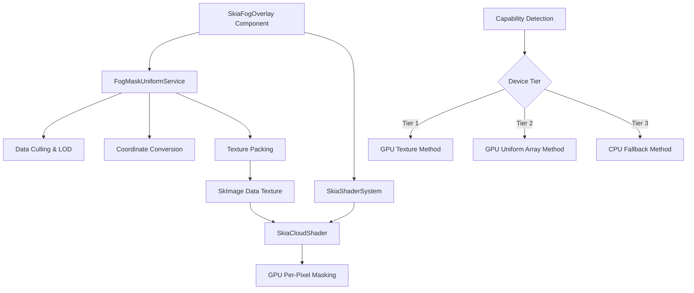

# Design Document

## Overview

The GPU Fog Optimization feature redesigns the fog of war rendering system to move computational load from CPU to GPU, achieving significant performance improvements while maintaining visual quality. The design centers around three core components: a data preparation service that optimizes exploration data, a GPU shader system that performs per-pixel masking, and a multi-tier fallback system that ensures compatibility across device capabilities.

## Architecture

### High-Level Architecture



### Data Flow Architecture

1. **Input Processing**: Raw exploration data (exploredAreas, dissipationAnimations) flows into FogMaskUniformService
2. **Optimization Pipeline**: Data undergoes culling, LOD clustering, and coordinate transformation
3. **GPU Preparation**: Optimized data is packed into RGBA texture format and converted to ImageShader
4. **Shader Execution**: GPU shader performs per-pixel masking using texture data
5. **Rendering Output**: Final fog overlay is rendered as a single full-screen Fill component

## Components and Interfaces

### FogMaskUniformService

**Location**: `src/services/cloudSystem/FogMaskUniformService.ts`

**Interface**:
```typescript
interface FogMaskUniformService {
  buildFogMaskUniforms(params: FogMaskParams): FogMaskUniforms;
  clearCache(): void;
  getPerformanceMetrics(): PerformanceMetrics;
}

interface FogMaskParams {
  exploredAreas: ExploredArea[];
  dissipationAnimations: DissipationAnimation[];
  viewport: ViewportBounds;
  zoom: number;
  deviceTier: DeviceTier;
}

interface FogMaskUniforms {
  circleDataShader: ImageShader;
  circleCount: number;
  texWidth: number;
  resolution: [number, number];
  featherPx: number;
  unpackScale: [number, number, number]; // viewport.width, viewport.height, max_radius
}
```

**Responsibilities**:
- Viewport-based culling with configurable padding
- Level of Detail (LOD) clustering using spatial grid algorithm
- Geographic to screen-space coordinate conversion
- RGBA texture packing with normalized values
- Short-lived caching for frame-to-frame optimization
- Performance metrics collection

### Enhanced SkiaCloudShader

**Location**: `src/services/cloudSystem/shaders/SkiaCloudShader.ts`

**Shader Uniforms**:
```glsl
uniform shader u_circleData;
uniform int u_circleCount;
uniform int u_texWidth;
uniform float2 u_resolution;
uniform float u_featherPx;
uniform float3 u_unpackScale;
```

**Shader Logic Flow**:
1. Calculate base fog color using existing cloud shader logic
2. Sample circle data from u_circleData texture
3. Denormalize packed circle data using u_unpackScale
4. Perform squared-distance checks for each circle (sqrt-free optimization)
5. Calculate soft edges using smoothstep and u_featherPx
6. Multiply base fog alpha by calculated mask alpha

### Refactored SkiaFogOverlay Component

**Location**: `src/components/SkiaFogOverlay.tsx`

**Interface**:
```typescript
interface SkiaFogOverlayProps {
  exploredAreas: ExploredArea[];
  dissipationAnimations: DissipationAnimation[];
  viewport: ViewportBounds;
  zoom: number;
  style?: ViewStyle;
}
```

**Component Structure**:
```tsx
export const SkiaFogOverlay: React.FC<SkiaFogOverlayProps> = (props) => {
  const uniforms = useFogMaskUniforms(props);
  const shader = useSkiaShader('cloudFog', uniforms);
  
  return (
    <Canvas style={StyleSheet.absoluteFillObject}>
      <Fill>
        <Paint>
          <Shader source={shader} />
        </Paint>
      </Fill>
    </Canvas>
  );
};
```

### Device Capability Detection System

**Location**: `src/services/cloudSystem/performance/DeviceCapabilityService.ts`

**Interface**:
```typescript
enum DeviceTier {
  TIER_1_GPU_TEXTURE = 'gpu_texture',
  TIER_2_GPU_UNIFORM = 'gpu_uniform', 
  TIER_3_CPU_FALLBACK = 'cpu_fallback'
}

interface DeviceCapabilityService {
  detectCapabilities(): Promise<DeviceTier>;
  testGPUTextureSupport(): Promise<boolean>;
  testGPUUniformSupport(): Promise<boolean>;
  getCachedTier(): DeviceTier | null;
}
```

**Detection Strategy**:
1. **Startup Test**: One-time capability detection on app initialization
2. **GPU Texture Test**: Attempt to create and sample from data texture in shader
3. **GPU Uniform Test**: Test uniform array limits and performance
4. **Caching**: Store detected tier in persistent storage for subsequent launches

## Data Models

### Circle Data Packing Format

**RGBA Texture Encoding**:
- **R Channel**: Normalized X coordinate (0-1)
- **G Channel**: Normalized Y coordinate (0-1) 
- **B Channel**: Normalized radius (0-1)
- **A Channel**: Circle type/animation state (0-1)

**Texture Layout**:
```
Pixel 0: Circle 0 data [R0, G0, B0, A0]
Pixel 1: Circle 1 data [R1, G1, B1, A1]
...
Pixel N: Circle N data [RN, GN, BN, AN]
```

### LOD Clustering Algorithm

**Spatial Grid Strategy**:
```typescript
interface ClusteringParams {
  gridSize: number;        // Grid cell size in screen pixels
  maxCirclesPerCell: number; // Maximum circles before merging
  mergeThreshold: number;   // Distance threshold for merging
}

interface ClusteredCircle {
  x: number;
  y: number;
  radius: number;
  weight: number;          // Number of original circles merged
  type: CircleType;
}
```

**Clustering Process**:
1. Divide viewport into spatial grid cells
2. Assign circles to grid cells based on center position
3. For cells exceeding maxCirclesPerCell, merge nearby circles
4. Use weighted averaging for merged circle properties
5. Preserve visual coverage while reducing data volume

## Error Handling

### Shader Compilation Errors

**Strategy**: Graceful degradation with detailed error reporting
- Catch SkSL compilation errors and log detailed information
- Automatically fall back to next available tier
- Provide developer-friendly error messages for debugging

### Texture Creation Failures

**Strategy**: Memory-aware fallback system
- Monitor texture creation success/failure rates
- Implement texture size limits based on device capabilities
- Fall back to uniform array method if texture creation fails

### Performance Degradation Detection

**Strategy**: Runtime performance monitoring
- Track frame times and detect performance regressions
- Automatically switch to lower tier if performance drops below threshold
- Provide user notification for manual tier selection

## Testing Strategy

### Unit Testing

**FogMaskUniformService Tests**:
- Data culling accuracy with various viewport configurations
- LOD clustering algorithm correctness and performance
- Coordinate conversion precision
- Texture packing/unpacking round-trip accuracy

**Shader Logic Tests**:
- Mock shader execution with known input/output pairs
- Edge case handling (empty data, single circle, maximum circles)
- Performance benchmarking with synthetic data

### Integration Testing

**End-to-End Rendering Tests**:
- Visual regression testing with screenshot comparison
- Performance profiling in realistic exploration scenarios
- Cross-device compatibility testing

**Fallback System Tests**:
- Forced tier switching scenarios
- Error injection testing for graceful degradation
- Capability detection accuracy across device types

### Performance Testing

**Benchmarking Scenarios**:
- Dense urban exploration (>5000 circles)
- Rapid viewport changes (panning/zooming)
- Memory usage under sustained load
- Battery impact assessment

**Success Criteria**:
- Maintain >30 FPS on mid-range devices with 2000+ circles
- <100ms response time for viewport changes
- <50MB additional memory usage
- <10% battery impact increase

## Performance Optimizations

### Frame-to-Frame Caching

**Strategy**: Minimize redundant calculations
- Cache texture data when viewport/zoom unchanged
- Implement dirty flagging for exploration data changes
- Use object pooling for temporary data structures

### Memory Management

**Strategy**: Efficient texture lifecycle management
- Implement texture recycling for repeated use
- Monitor memory pressure and adjust texture resolution
- Use compressed texture formats where supported

### Batch Processing

**Strategy**: Optimize data preparation pipeline
- Process multiple frames of exploration data in batches
- Use Web Workers/background threads where available
- Implement progressive loading for large datasets

## Migration Strategy

### Phase 1: Parallel Implementation
- Implement new system alongside existing CPU-based system
- Add feature flag for A/B testing
- Maintain full backward compatibility

### Phase 2: Gradual Rollout
- Deploy to subset of users based on device capabilities
- Monitor performance metrics and user feedback
- Implement rollback mechanism for issues

### Phase 3: Full Migration
- Switch default implementation to GPU-based system
- Mark old components as deprecated
- Provide migration guide for custom implementations

### Rollback Plan
- Maintain CPU fallback system indefinitely
- Implement automatic rollback triggers based on error rates
- Provide manual override for users experiencing issues